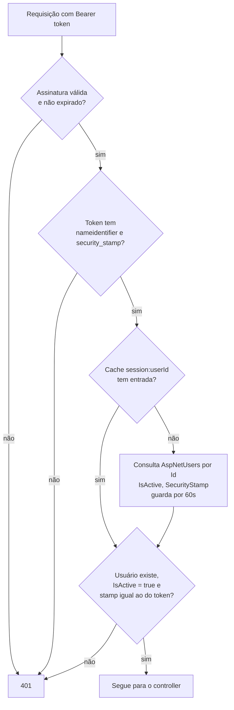

# Spec #21: Exclusão de Conta, Revogação de Sessão e Edição de Perfil

**Módulo:** Conta / Autenticação (`ApplicationUser` + `Property` + validação do JWT)
**Versão:** 1.0
**Data:** 27/Set/2026
**Fonte:** Definição do TCC (27/Set) — exclusão de conta pelo próprio usuário com remoção de todos os dados (LGPD / Política de Privacidade §5.1), corte imediato de acesso e edição do próprio perfil.
**Status:** Implementada
**Depende de:** Spec de Gestão de Membros (`UserRole`, `[Authorize(Roles = "Admin")]`, revogação via `IsActive`). Fluxo de autenticação existente (`AuthController`, `TenantProvider`, JWT com `property_id`).

> **Decisões de escopo desta spec:**
> - **Só o `Admin` exclui a própria conta**, e a exclusão **apaga a propriedade inteira**: todos os membros, rebanho, reprodução, produção, sanidade, estoque e catálogos da propriedade. `Member` não tem essa ação (`403`).
> - **Exclusão é física (hard delete)**, exceção declarada à regra de soft delete do projeto: o objetivo é justamente eliminar os dados (LGPD).
> - **O acesso é cortado na hora**: o token é revalidado a cada requisição contra o usuário no banco. Isso vale para conta excluída, membro revogado, troca de senha e troca de papel.
> - **A propriedade não ganha campos novos.** Foi avaliado (cidade/UF, área, atividade, inscrição estadual/CAR) e descartado: não há funcionalidade que use esses dados, então não se pede.
> - **Perfil editável**: nome, telefone e senha. E-mail **não** é editável nesta spec.

---

## 1. Contexto e Objetivo

A Política de Privacidade (`wwwroot/privacy.html`, §5.1) promete a exclusão da conta e de todos os dados associados, hoje atendida **manualmente por e-mail**. Não existe endpoint para isso, e as lojas de aplicativos exigem que a exclusão possa ser iniciada de dentro do app.

Há também uma lacuna de segurança: o JWT vale **24h** e é validado só pela assinatura. Um membro revogado (`IsActive = false`) não consegue logar de novo, mas **o token que ele já tem continua funcionando até expirar**. O mesmo aconteceria com uma conta excluída (com o agravante de o `property_id` do token apontar para uma propriedade que não existe mais) e com um admin rebaixado, que manteria o claim `role = Admin`.

Esta spec entrega três coisas:
1. **Revogação imediata de sessão** — o token deixa de valer assim que o usuário é excluído, revogado, troca a senha ou muda de papel.
2. **Exclusão de conta pelo Admin** — apaga a propriedade e tudo que pertence a ela.
3. **Edição do próprio perfil** — nome, telefone e senha.

---

## 2. Decisões Registradas

| # | Decisão | Motivo |
|---|---------|--------|
| D1 | Só o **`Admin`** pode excluir a própria conta. `Member` recebe `403`. | Definido no TCC (27/Set). Os dados pertencem à propriedade, não ao membro; quem responde pela propriedade é o admin. |
| D2 | Excluir a conta do Admin **apaga a propriedade inteira**: todos os usuários da propriedade (inclusive outros admins) e todas as tabelas com `PropertyId`. | "Excluir minha conta apaga todos os meus dados": para o admin, os dados dele **são** os da propriedade. |
| D3 | **Hard delete** (`DELETE` físico), em **uma transação**. | Exceção à regra de soft delete: a finalidade é eliminar dados (LGPD). Transação garante que não sobra propriedade pela metade. |
| D4 | A exclusão exige **reconfirmação da senha** no corpo da requisição. | Ação destrutiva e irreversível; impede que um token vazado ou um aparelho desbloqueado apague a fazenda. |
| D5 | Senha incorreta em ações de conta → **`422`**, não `401`. | O app trata `401` como "sessão expirada" e desloga. Senha errada numa confirmação não é sessão inválida. |
| D6 | **Validação do token a cada requisição** (`JwtBearerEvents.OnTokenValidated`): o usuário precisa existir, estar `IsActive` e ter o mesmo `SecurityStamp` gravado no token. Senão, `401`. | Corta o acesso na hora (ver §1). Consulta por chave primária (`AspNetUsers.Id`), barata. |
| D7 | Resultado da validação **cacheado em memória por 60s** por usuário (`IMemoryCache`), e **invalidado explicitamente** nas ações que mudam o estado (revogar, excluir, trocar senha, trocar papel). | Ambiente restrito: evita uma consulta por requisição. A invalidação explícita mantém o corte imediato; os 60s só valem para mudanças feitas fora da API. |
| D8 | Novo claim **`security_stamp`** no JWT, com o `SecurityStamp` do Identity. | Mecanismo nativo do Identity para invalidar sessões. Basta chamar `UpdateSecurityStampAsync` para derrubar todos os tokens do usuário. |
| D9 | **Troca de senha** e **troca de papel** (Spec de Membros, `PATCH /api/users/{id}`) chamam `UpdateSecurityStampAsync`. | Troca de senha derruba as outras sessões. Troca de papel força novo login, e o token novo sai com o `role` correto. |
| D10 | A troca de senha **devolve um token novo** (`AuthResponseDto`). | O stamp mudou, então o token atual morre; devolver o novo evita um login extra (menos requisições). |
| D11 | Perfil editável: **`Name`** e **`PhoneNumber`** (campo já existente no Identity). **E-mail não é editável.** | Definido no TCC. Trocar e-mail muda o login e exigiria confirmação; fica fora. |
| D12 | **Nenhum campo novo em `Property`.** | Definido no TCC: sem uso no sistema, sem coleta (princípio da necessidade da LGPD). |
| D13 | Lógica de perfil e senha fica no **`AuthController`** com `UserManager` (como a Spec de Membros, D9). A exclusão em massa vai para um **service + repositório** (`AccountService` / `AccountRepository`). | Perfil é Identity puro. A exclusão percorre ~20 tabelas e merece uma camada própria, testável com o repositório mockado. |

---

## 3. Histórias de Usuário

### US-01 — Perder o acesso na hora ao ser revogado
> **Como** administrador,
> **quero** que um membro revogado perca o acesso imediatamente,
> **para** não precisar esperar o token dele expirar.

**Critérios de aceite:**
- Depois do `PATCH /api/users/{id}/revoke`, a próxima requisição do membro revogado recebe `401`.
- O mesmo vale depois de uma troca de papel: o usuário recebe `401` e, ao logar de novo, o token sai com o papel novo.

### US-02 — Excluir minha conta e todos os dados
> **Como** administrador da propriedade,
> **quero** excluir minha conta pelo app,
> **para** que todos os meus dados e os da fazenda sejam apagados.

**Critérios de aceite:**
- Informo minha senha para confirmar.
- Senha incorreta → `422`, nada é apagado.
- Tudo da propriedade é apagado: membros, animais e todos os registros ligados a eles, sêmen, estoque, vacinas e medicamentos cadastrados.
- Qualquer token da propriedade (meu e dos membros) passa a receber `401`.
- Um `Member` **não** tem essa ação (`403`).

### US-03 — Editar meu perfil
> **Como** usuário (admin ou membro),
> **quero** alterar meu nome e telefone,
> **para** manter meus dados corretos.

**Critérios de aceite:**
- `PATCH` altera apenas os campos enviados.
- Telefone em formato inválido → `400`.
- Envio `""` no telefone para removê-lo.

### US-04 — Trocar minha senha
> **Como** usuário (admin ou membro),
> **quero** trocar minha senha informando a atual,
> **para** manter minha conta segura, inclusive trocando a senha temporária que recebi do admin.

**Critérios de aceite:**
- Senha atual incorreta → `422`.
- Nova senha fora da política do Identity → `400` com as mensagens.
- Recebo um token novo e continuo logado neste aparelho; minhas outras sessões recebem `401`.

---

## 4. Casos de Uso

### CU-01 — Validar sessão a cada requisição
1. Requisição autenticada chega; o JWT passa na validação de assinatura e expiração.
2. `OnTokenValidated` lê `NameIdentifier` e `security_stamp` do token.
3. Busca no cache (`session:{userId}`); se não houver, consulta `AspNetUsers` por `Id` (projeção só de `IsActive` e `SecurityStamp`) e guarda por 60s.
4. Usuário inexistente, `IsActive == false`, ou stamp diferente → `context.Fail(...)` → `401`.
5. Token sem o claim `security_stamp` (emitido antes desta spec) → `401`. O usuário loga uma vez e passa a ter o claim.

### CU-02 — Excluir conta (Admin)
1. `DELETE /api/auth/me` com `DeleteAccountDto { Password }`, token de `Admin`.
2. `Member` → `403` (`[Authorize(Roles = "Admin")]`).
3. `CheckPasswordAsync` falha → `BusinessRuleException` (`422`).
4. Lê os `Id`s de todos os usuários da propriedade (para invalidar o cache depois).
5. `AccountService.DeletePropertyAsync(propertyId)` → `AccountRepository` apaga tudo em uma transação, na ordem de §5.5.
6. Remove do cache as entradas `session:{userId}` de todos os usuários da propriedade.
7. Retorna `204 No Content`.

### CU-03 — Editar perfil
1. `PATCH /api/auth/me` com `UpdateProfileDto { Name?, PhoneNumber? }`.
2. Valida DTO; inválido → `400`.
3. Aplica os campos enviados (`null` = não altera; `PhoneNumber = ""` = remove).
4. Retorna `200 CurrentUserResponseDto`.

### CU-04 — Trocar senha
1. `PATCH /api/auth/me/password` com `ChangePasswordDto { CurrentPassword, NewPassword }`.
2. `ChangePasswordAsync` do Identity:
   - senha atual incorreta (`PasswordMismatch`) → `422`;
   - outros erros (política de senha) → `400` com as mensagens.
3. `ChangePasswordAsync` já atualiza o `SecurityStamp`; invalida o cache do usuário.
4. Gera token novo e retorna `200 AuthResponseDto`.

---

## 5. Especificação Técnica

### 5.1 Modelos
**Nenhuma alteração de modelo.**
- `ApplicationUser.PhoneNumber` e `ApplicationUser.SecurityStamp` já existem (herdados de `IdentityUser`).
- `Property` permanece só com `Id`, `Name`, `CreatedAt` (D12).

### 5.2 DTOs
> `Application/DTOs/`

- **`UpdateProfileDto`** (novo) — `Name?` (`[MaxLength(150)]`, não pode ser só espaços quando enviado), `PhoneNumber?` (`[MaxLength(20)]`, regex `^$|^\+?[\d\s\-\(\)]{8,20}$`; `""` remove). Não se usa `[Phone]` porque ele rejeita `""`.
- **`ChangePasswordDto`** (novo) — `CurrentPassword` (`[Required]`), `NewPassword` (`[Required]`, `[MinLength(6)]`).
- **`DeleteAccountDto`** (novo) — `Password` (`[Required]`).
- **`CurrentUserResponseDto`** (existente, ajustado) — adicionar **`PhoneNumber`** (`string?`).

### 5.3 Endpoints da API
> Auth: Bearer Token obrigatório em todos.

| Método | Rota | Papel | Descrição | Retorno |
|--------|------|-------|-----------|---------|
| `PATCH` | `/api/auth/me` | qualquer | Editar nome e/ou telefone | `200 CurrentUserResponseDto` / `400` |
| `PATCH` | `/api/auth/me/password` | qualquer | Trocar senha | `200 AuthResponseDto` / `400` / `422` |
| `DELETE` | `/api/auth/me` | `Admin` | Excluir conta e toda a propriedade | `204` / `403` / `422` |

> **`DELETE` com corpo:** o ASP.NET aceita. No Android com Retrofit, usar `@HTTP(method = "DELETE", path = "api/auth/me", hasBody = true)`, porque `@DELETE` não aceita `@Body`.

### 5.4 Validação de sessão (D6–D10)

#### 5.4.1 O problema: JWT sem estado
O JWT é um texto **assinado** pela API com os dados do usuário (claims). Até esta spec, cada requisição verificava só:
1. **Assinatura válida** — ninguém alterou o token;
2. **Não expirado** — validade de 24h.

O banco não era consultado. Isso é rápido, mas torna o token **irrevogável**: o bloqueio de login só impede emitir um token *novo*, e o token já emitido continua valendo até expirar. Na prática:

| Situação | Efeito sem a validação de sessão |
|----------|----------------------------------|
| Membro revogado | Continua acessando por até 24h |
| Conta excluída | Token aponta para uma propriedade que não existe mais |
| Admin rebaixado | Token continua com `role = Admin` por até 24h |
| Senha trocada (ex.: por suspeita de vazamento) | Quem tem o token antigo continua entrando |

#### 5.4.2 O carimbo de segurança (`SecurityStamp`)
O ASP.NET Identity mantém em `AspNetUsers.SecurityStamp` um código aleatório que funciona como a **versão das credenciais** do usuário. O Identity gera um código novo em `ChangePasswordAsync` e em `UpdateSecurityStampAsync`.

No login, esse código é copiado para o token como o claim **`security_stamp`** (`AuthController.GenerateJwtToken`):

```
Token (claims)
├── nameidentifier: "a1b2..."     id do usuário
├── property_id:    "f9e8..."     tenant
├── role:           "Member"      papel (Spec de Membros)
└── security_stamp: "XK7P2QW..."  versão das credenciais
```

Comparar o carimbo do token com o do banco diz se o token é anterior à última mudança de credenciais:
- **Iguais** → token vale.
- **Diferentes** → algo mudou depois da emissão, e o token é recusado.

> Usuário antigo com `SecurityStamp` vazio: o login chama `UpdateSecurityStampAsync` antes de emitir o token.

#### 5.4.3 Fluxo de cada requisição
Em `Program.cs`, a configuração do JWT Bearer registra `JwtBearerEvents.OnTokenValidated`. Ele roda **depois** de assinatura e validade serem aprovadas, e delega para `ISessionValidator` (`Infrastructure/Services/SessionValidator.cs`).



A consulta é por chave primária e projeta só `IsActive` e `SecurityStamp`, sem carregar a entidade.

#### 5.4.4 Cache e invalidação explícita (D7)
Para não consultar o banco a cada requisição (ambiente restrito), o resultado fica em `IMemoryCache` por **60 segundos**, com a chave `session:{userId}`. Um usuário ativo gera no máximo uma consulta a cada 60s.

Para que o corte continue **imediato**, toda ação que muda o estado da sessão remove a entrada do cache (`ISessionValidator.Invalidate`). Assim, a requisição seguinte vai obrigatoriamente ao banco:

| Ação | Onde | Mudança no banco | Efeito no token antigo |
|------|------|------------------|------------------------|
| Revogar membro | `UsersController.Revoke` | `IsActive = false` | `401` na próxima requisição |
| Reativar membro | `UsersController.Reactivate` | `IsActive = true` | Evita que o cache ainda diga "inativo" após o novo login |
| Trocar papel | `UsersController.Update` | `UpdateSecurityStampAsync` | `401`; o novo login traz o `role` correto |
| Trocar senha | `AuthController.ChangePassword` | `ChangePasswordAsync` (gera stamp novo) | Outras sessões recebem `401`; o aparelho atual recebe token novo (D10) |
| Excluir conta | `AccountService.DeletePropertyAsync` | Usuários e propriedade apagados | `401` para **todos** os membros da propriedade |

A janela de 60s só se aplica a mudanças feitas **fora da API** (ex.: SQL direto no banco).

#### 5.4.5 Escopo próprio do `DbContext`
O `ApplicationDbContext` captura o `PropertyId` do `ITenantProvider` **no construtor**, uma vez por requisição. O `OnTokenValidated` roda **antes** de `HttpContext.User` estar preenchido. Se o validador usasse o `DbContext` da requisição, esse contexto nasceria com `PropertyId = Guid.Empty`, e **todos os filtros de tenant da requisição retornariam vazio**.

Por isso o `SessionValidator` é registrado como **singleton** e, quando precisa ir ao banco, cria um **escopo próprio** (`IServiceScopeFactory`) com um `DbContext` separado. O contexto da requisição continua sendo criado depois, já com o usuário autenticado.

#### 5.4.6 Registro de DI (`Program.cs`)
```csharp
builder.Services.AddScoped<IAccountRepository, AccountRepository>();
builder.Services.AddScoped<IAccountService, AccountService>();
builder.Services.AddMemoryCache();
builder.Services.AddSingleton<ISessionValidator, SessionValidator>();
```

#### 5.4.7 Consequências para o app
- **Tokens emitidos antes desta spec** não têm `security_stamp` e recebem `401`. Cada usuário loga de novo uma vez.
- **Todo `401` significa "sessão encerrada"**: o app limpa o token e os dados locais e volta ao login.
- Por isso, **senha incorreta** na troca de senha ou na exclusão devolve **`422`**, e não `401` (D5). Assim o app não desloga o usuário por ter digitado a senha errada.

### 5.5 Ordem de exclusão (D3)
Todas as FKs entre tabelas de domínio são `Restrict`, então a exclusão vai **das folhas para a raiz**, com `ExecuteDeleteAsync` filtrando por `PropertyId` (ou por `AnimalId` dos animais da propriedade, nas tabelas sem `PropertyId`). Tudo dentro de uma transação.

| # | Tabela | Filtro | Observação |
|---|--------|--------|------------|
| 1 | `MastitisTests` | `PropertyId` | → `HealthCases` |
| 2 | `AnimalMedications` | `PropertyId` | → `HealthCases`, `Medications`, `Animals` |
| 3 | `HealthCases` | `PropertyId` | |
| 4 | `VaccinationEventAnimals` | `PropertyId` | |
| 5 | `VaccinationEvents` | `PropertyId` | Antes: `UPDATE ... SET ParentEventId = NULL` (auto-referência `Restrict`) |
| 6 | `Lactations` | `PropertyId` | → `AnimalCalvings` |
| 7 | `AnimalCalvingCalves` | `PropertyId` | → `AnimalCalvings`, `Animals` |
| 8 | `AnimalCalvings` | `PropertyId` | → `AnimalPregnancies` |
| 9 | `AnimalPregnancies` | `PropertyId` | → `BreedingEvents`, `SemenSamples` |
| 10 | `SemenSampleMovements` | `PropertyId` | → `BreedingEvents`, `SemenSamples` |
| 11 | `BreedingEvents` | `PropertyId` | → `SemenSamples` |
| 12 | `SemenSamples` | `PropertyId` | |
| 13 | `MilkProductions` | `PropertyId` | |
| 14 | `WeightRecords` | `PropertyId` | |
| 15 | `BodyConditionRecords` | `AnimalId` ∈ animais da propriedade | Sem `PropertyId` |
| 16 | `AnimalExitRecords` | `AnimalId` ∈ animais da propriedade | Sem `PropertyId` |
| 17 | `StockMovements` | `PropertyId` | → `StockItems` |
| 18 | `StockItems` | `PropertyId` | |
| 19 | `Animals` | `PropertyId` | |
| 20 | `Vaccines` | `PropertyId` | Catálogo semeado no registro |
| 21 | `Medications` | `PropertyId` | |
| 22 | `AspNetUsers` | `PropertyId` | Claims/Logins/Tokens do Identity caem em cascata |
| 23 | `Properties` | `Id` | |

**Não** apagar: `StockCategories` e `UnitsOfMeasure` (catálogos globais, semeados por `HasData`).

> Ao implementar, conferir a lista contra o `ApplicationDbContextModelSnapshot` — qualquer tabela nova com `PropertyId` criada depois desta spec precisa entrar aqui.
> Os filtros globais de tenant do `DbContext` usam o `property_id` do token, que é o mesmo da propriedade apagada; ainda assim, **filtrar explicitamente por `PropertyId` em toda instrução**, para não depender do filtro.

### 5.6 Regras de Negócio
| # | Regra | Onde aplicar |
|---|-------|-------------|
| RN-01 | Só `Admin` exclui a conta. | `[Authorize(Roles = "Admin")]` na ação `DELETE /api/auth/me` |
| RN-02 | Excluir a conta apaga a propriedade e todos os seus usuários e dados, em uma transação. | `AccountService` → `AccountRepository` |
| RN-03 | Exclusão exige a senha atual; senha incorreta → `422`. | `AuthController` → `BusinessRuleException` |
| RN-04 | Token de usuário inexistente, inativo ou com `security_stamp` diferente → `401`. | `OnTokenValidated` → `ISessionValidator` |
| RN-05 | Revogar, reativar, excluir, trocar senha e trocar papel invalidam o cache de sessão do usuário afetado. | `UsersController`, `AuthController`, `AccountService` |
| RN-06 | Trocar papel atualiza o `SecurityStamp` (força novo login com o papel correto). | `UsersController.Update` |
| RN-07 | Trocar senha exige a senha atual (`422` se incorreta) e devolve token novo. | `AuthController` |
| RN-08 | Perfil edita só `Name` e `PhoneNumber`; e-mail não é editável. | `UpdateProfileDto` |

### 5.7 Camadas Impactadas
| Camada | Arquivo | Ação |
|--------|---------|------|
| `Application/DTOs` | `UpdateProfileDto.cs`, `ChangePasswordDto.cs`, `DeleteAccountDto.cs` | **Criar** |
| `Application/DTOs` | `AuthResponseDto.cs` (`CurrentUserResponseDto`) | **Ajustar** — adicionar `PhoneNumber` |
| `Application/Interfaces` | `IAccountService.cs`, `IAccountRepository.cs`, `ISessionValidator.cs` | **Criar** |
| `Application/Services` | `AccountService.cs` | **Criar** |
| `Infrastructure/Repositories` | `AccountRepository.cs` | **Criar** — exclusão em ordem (§5.5) |
| `Infrastructure/Services` | `SessionValidator.cs` | **Criar** — consulta + `IMemoryCache` |
| `Api/Controllers` | `AuthController.cs` | **Ajustar** — claim `security_stamp`; `PATCH me`, `PATCH me/password`, `DELETE me`; `/me` devolve `PhoneNumber` |
| `Api/Controllers` | `UsersController.cs` | **Ajustar** — invalidar sessão em `Revoke`; `UpdateSecurityStampAsync` + invalidar na troca de `Role` |
| `Program.cs` | JWT + DI | **Ajustar** — `OnTokenValidated`, `AddMemoryCache`, registros novos. **Requer aprovação.** |
| `MuuBoi.Tests` | `AccountServiceTests.cs` | **Criar** — repositório mockado |
| `wwwroot` | `privacy.html` | **Ajustar** (ver §7) |

---

## 6. Notas de Migração

**Nenhuma migração necessária.** `PhoneNumber` e `SecurityStamp` já são colunas de `AspNetUsers`, e `Property` não muda.

> Usuários antigos podem ter `SecurityStamp` nulo. O Identity preenche o stamp ao criar usuários; se algum registro estiver nulo, `GenerateJwtToken` deve chamar `UpdateSecurityStampAsync` antes de emitir o token (ou o login faz isso quando o stamp está vazio).

---

## 7. Impactos fora do código

- **Política de Privacidade (`privacy.html`)**:
  - §1.1 (dados coletados): incluir **telefone (opcional)**, com a finalidade "contato e identificação do usuário na propriedade".
  - §5.1 (exclusão): descrever a exclusão **pelo próprio app** (menu de conta, pelo administrador), mantendo o e-mail como canal alternativo — em especial para **membros**, que não têm a ação no app (ver O-01).
- **App (front)**:
  - Tela de confirmação da exclusão explicando que **toda a fazenda e todos os membros** serão apagados.
  - Tratar `401` como fim de sessão: limpar o token **e os dados locais** do aparelho (o que importa depois de uma exclusão).

---

## 8. Pontos em Aberto

| # | Ponto | Sugestão |
|---|-------|----------|
| O-01 | **Membro que quer excluir a própria conta.** Pela D1 ele não tem a ação; revogar mantém nome, e-mail e telefone dele no banco. A LGPD dá ao titular o direito de pedir a eliminação. | Manter o canal por e-mail da política (§5.1) para membros. Evolução possível: o admin "excluir membro" com hard delete ou anonimização (`Name = "Membro removido"`, e-mail/telefone apagados). |
| O-02 | **Propriedade com mais de um admin.** Qualquer admin pode apagar a fazenda inteira, inclusive a conta dos outros admins. | Aceito pela D2. A confirmação por senha (D4) e o aviso na tela reduzem o risco de acidente. |
| O-03 | **Sincronização offline (Spec #14).** Um aparelho com registros pendentes, após a exclusão, recebe `401` no próximo sync. | Descartar a fila local ao receber `401` (§7). Nenhuma mudança no contrato de sync. |

---

## 9. Fora do Escopo desta Spec

- **Novos campos em `Property`** (cidade/UF, área, atividade, inscrição estadual/CAR) — descartados (D12).
- **Troca de e-mail** — muda o login e exigiria confirmação por e-mail.
- **"Esqueci minha senha"** — exige envio de e-mail; fluxo próprio.
- **Exclusão de conta por `Member`** — ver O-01.
- **Período de carência / recuperação** após a exclusão (ex.: 30 dias para desfazer) — a exclusão é imediata e definitiva.
- **Exportação dos dados antes de excluir** (portabilidade) — evolução futura.
- **Refresh token / sessões nomeadas por aparelho** — o corte de acesso é feito pelo `SecurityStamp`, sem lista de sessões.
